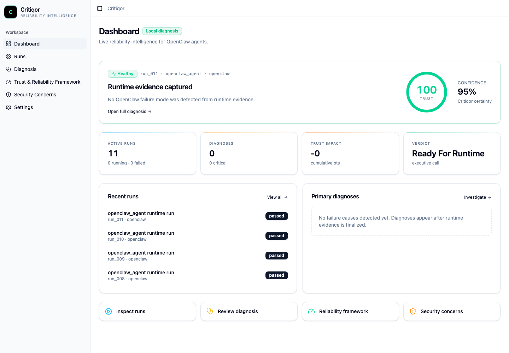

<p align="center">
  
</p>

<h1 align="center">Critiqor</h1>

<p align="center">
  <strong>Runtime Intelligence for AI Agents</strong>
</p>

<p align="center">
  Observe. Diagnose. Improve.
</p>

<p align="center">
  <a href="https://pypi.org/project/critiqor/"></a>
  
  
  
</p>

<p align="center">
  <code>pip install critiqor</code>
</p>

Critiqor helps developers understand whether AI agent runs can be trusted. It observes agent execution, produces a reliability report, and gives teams a clearer way to review agent behavior before relying on the result.

Instead of asking an agent to explain itself after the fact, Critiqor focuses on observable behavior from the run.

---

## Introduction

AI agents are powerful, but a final answer does not always tell the whole story.

An agent can return something useful while still behaving unreliably during execution. Critiqor gives developers a practical review layer for understanding whether a run looked healthy, risky, inefficient, or worth investigating further.

With Critiqor, you can:

- observe agent runs from the terminal
- review reliability reports in a dashboard
- compare previous runs
- spot behavior that needs developer review
- improve agents with measurable feedback

---

## Dashboard Preview



After an observation session, Critiqor opens a dashboard that summarizes the run in a format designed for developers and teams.

You can review:

- **Executive Summary** - the fast answer on whether the run looks healthy
- **Trust Assessment** - readiness and confidence signals
- **Primary Diagnosis** - what deserves attention
- **Run Review** - the observed behavior behind the report
- **Recommendations** - practical next steps
- **Historical Runs** - previous observations for comparison

---

## Installation

Install Critiqor from PyPI:

```bash
pip install critiqor
```

Check the CLI:

```bash
critiqor help
```

---

## Operating System Compatibility

Critiqor is distributed as a Python CLI package. The package can be installed anywhere Python 3.10+ is available, but the best installation path depends on the operating system and terminal environment.

| Operating system | Compatibility | Recommended install path |
| --- | --- | --- |
| macOS | Supported | Python 3.10+ with `pip` or `pipx` |
| Linux | Supported | Distro Python package manager, then `pip` or `pipx` |
| Windows | Supported with WSL recommended | WSL2 for OpenClaw workflows, or native Windows Python for basic CLI usage |

### macOS

**Compatibility: supported and recommended.**

macOS provides a reliable terminal environment for Critiqor's OpenClaw observation workflow.

```bash
python3 --version
python3 -m pip install critiqor
critiqor help
```

Optional isolated install with `pipx`:

```bash
brew install pipx
pipx install critiqor
```

Notes:

- Use Python 3.10 or newer.
- If `pip` is missing, install Python from python.org or Homebrew.
- Make sure OpenClaw is installed and available on your `PATH` before running `critiqor monitor openclaw`.

### Linux

**Compatibility: supported and recommended.**

Linux is a strong environment for Critiqor because terminal process handling and OpenClaw runtime workflows are typically predictable.

Debian or Ubuntu setup:

```bash
sudo apt update
sudo apt install python3 python3-pip python3-venv
python3 -m pip install critiqor
critiqor help
```

Fedora setup:

```bash
sudo dnf install python3 python3-pip
python3 -m pip install critiqor
critiqor help
```

Arch setup:

```bash
sudo pacman -S python python-pip
python -m pip install critiqor
critiqor help
```

Notes:

- Use your distro package manager to install Python and pip first.
- A virtual environment is recommended if your distribution restricts global Python installs.
- Make sure OpenClaw is installed and available on your `PATH`.

### Windows

**Compatibility: supported, with WSL2 recommended for OpenClaw monitoring.**

Critiqor can be installed on native Windows when Python 3.10+ is available. However, OpenClaw terminal/TUI behavior and child-process handling can vary across PowerShell, Command Prompt, and terminal emulators. For the most reliable Critiqor + OpenClaw workflow, use Windows Subsystem for Linux 2.

Recommended WSL2 workflow:

```bash
sudo apt update
sudo apt install python3 python3-pip python3-venv
python3 -m pip install critiqor
critiqor monitor openclaw
```

Native PowerShell workflow:

```powershell
py --version
py -m pip install critiqor
critiqor help
```

Notes:

- Use WSL2 when running `critiqor monitor openclaw`.
- Native Windows is suitable for checking the CLI, opening reports, and basic workflows.
- If using PowerShell directly, verify OpenClaw itself runs correctly before starting Critiqor.
- The dashboard opens in your browser after a completed run.

---

## Quick Start

### 1. Start an observation session

```bash
critiqor monitor openclaw
```

Critiqor starts the OpenClaw workflow and begins observing the run.

### 2. Use OpenClaw normally

Work with your agent as usual. Critiqor stays out of the way while the agent runs.

### 3. Finalize the observation

```bash
critiqor finalize
```

Critiqor completes the observation, prepares the reliability report, and opens the dashboard.

### 4. Reopen previous runs

List historical evaluations:

```bash
critiqor runs
```

Open the latest dashboard:

```bash
critiqor dashboard
```

Open a specific run:

```bash
critiqor dashboard run_001
```

---

## Features

### Terminal-First Workflow

Start and finish agent observations directly from the Critiqor CLI.

### Reliability Reports

Review whether a run looks healthy, needs review, or should be treated with caution.

### Dashboard Review

Move from terminal execution to a visual report built for debugging, communication, and decision-making.

### Historical Runs

Revisit previous observations and compare reliability over time.

### OpenClaw Support

Critiqor currently focuses on OpenClaw-based agent workflows.

---

## When to Use

Use Critiqor when you need to:

- validate agent changes before release
- debug failed or suspicious runs
- compare prompt iterations
- review new agent tools or skills
- catch regressions in behavior
- measure reliability improvements over time
- explain agent behavior to teammates or stakeholders
- decide whether an agent run is ready for production workflows

---

## Trust & Privacy

Critiqor is designed around explicit observation.

Developers control when observation starts, when it ends, and which results they review or share. Critiqor provides reliability signals to support developer judgment; it does not replace tests, human review, or production monitoring.

Principles:

- observation should be explicit
- reports should be grounded in the observed run
- developers should be able to review the result
- sensitive workflow data should remain under user control
- reliability reports should support human decision-making

---

## Philosophy

Critiqor is built on a simple belief:

> Reliable agents should be evaluated by what they do, not what they say they did.

That means:

- evaluate observable behavior
- prioritize evidence over self-reporting
- make reliability easier to explain
- improve through measurement
- help developers review the work behind the answer

---

## FAQ

### What is Critiqor?

Critiqor is an AI Agent Runtime Intelligence Platform. It helps developers observe agent runs and review reliability reports.

### Which workflows are supported?

Critiqor currently supports OpenClaw-focused observation workflows.

### How do I install Critiqor?

```bash
pip install critiqor
```

### What does the dashboard show?

The dashboard shows an executive summary, trust assessment, primary diagnosis, run review, recommendations, and historical runs.

### How should I interpret trust levels?

Trust levels are reliability signals based on the observed run. They help you decide whether a run looks healthy, needs review, or may be risky.

### Can I review previous runs?

Yes. Use:

```bash
critiqor runs
critiqor dashboard run_001
```

### Does Critiqor replace tests?

No. Critiqor complements tests by helping you review how an agent behaved during a run. Use it alongside unit tests, integration tests, evals, and human review.

### How do I report bugs?

Open a GitHub issue with:

- your Critiqor version
- your Python version
- the command you ran
- what you expected
- what happened instead

---

## Contributing

Critiqor is early and evolving quickly.

Useful contributions include:

- bug reports
- documentation improvements
- OpenClaw workflow feedback
- dashboard usability feedback
- integration requests

If you are proposing a larger change, please open an issue first so the direction can be discussed.

---

## License

Critiqor is released under the MIT License. See [LICENSE](LICENSE) for details.
