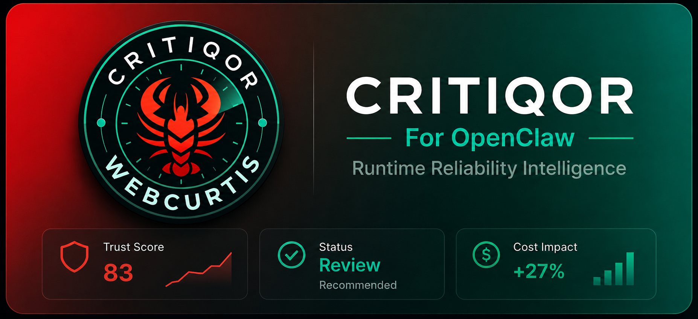
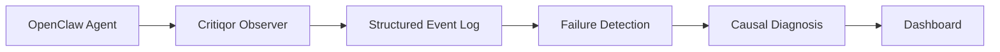
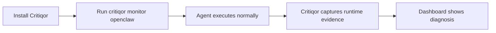
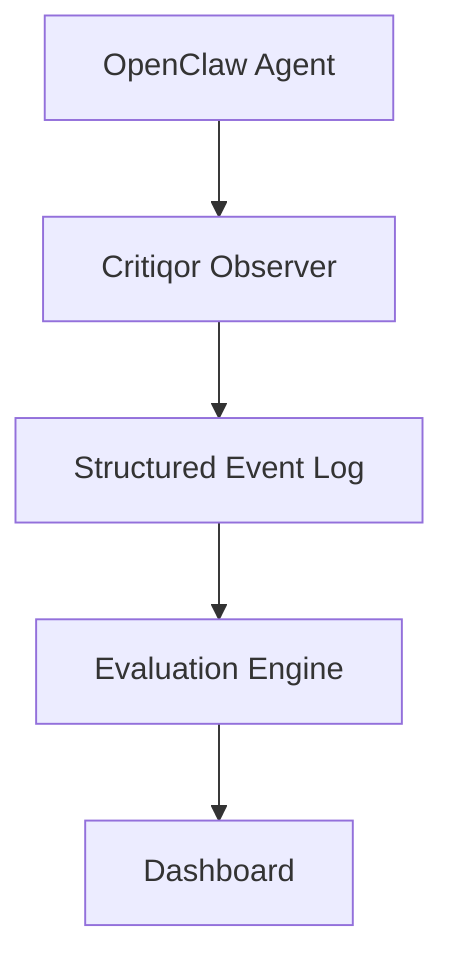
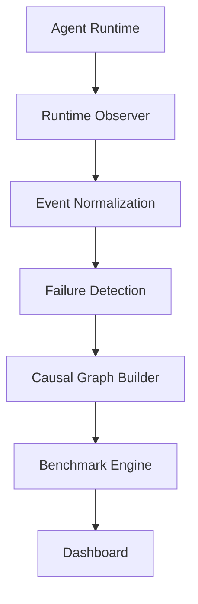

# Critiqor




Critiqor evaluates observable agent behavior instead of relying only on agent
self-reporting. It can score a final response, analyze supplied execution
traces, collect evidence through lightweight SDK instrumentation, explain why a
run failed, recommend fixes, compare releases, rank agents across categories,
debug causal failure chains, run benchmarks, certify reliability, gate
deployments, and track reliability over time.

The core rule: captured execution data is stronger evidence than post-hoc
explanations.


## Dashboard Experience

Critiqor's dashboard is organized for progressive disclosure. New users see the
simplest answer first, while technical users can drill into evidence and causal
detail.

| Section | Purpose | Shows |
| --- | --- | --- |
| Overview | Executive-friendly summary | Trust score, readiness, primary diagnosis, recommended action, latest run status |
| Diagnosis | Explain why the agent failed | Primary failure mode, causal chain, severity, impact, recommended fix |
| Cost | Show operational waste | Extra cost, duplicate calls, redundancy score, cost efficiency |
| Evidence | Technical audit trail | Tool calls, tool outputs, memory events, retries, errors, state transitions, full trace |
| Why It Happened | Causal explanation | Precomputed causal graph, step-by-step chain, root cause |
| Benchmarks | Compare over time | Benchmark score, difficulty tier, percentile, trend |
| Trust & Privacy | Reduce adoption friction | Evidence collection model, data access boundaries, visibility controls, FAQ |

Onboarding is built around two simple flows:





Default dashboard route: `Overview`. Raw JSON and full traces only appear in the
`Evidence` section.

## Trust & Privacy

Critiqor is designed to answer two questions clearly: how evidence is obtained,
and why users can trust Critiqor with agent runtime data.

### How Critiqor Works



Critiqor does **not**:

- read agent thoughts
- scan filesystem contents
- intercept unrelated processes
- collect hidden telemetry

Critiqor does:

- observe runtime events
- capture tool calls
- capture tool outputs
- capture memory events
- capture retries
- capture execution traces

### Data Flow Architecture



The dashboard displays precomputed structured outputs. It does not compute
failure causes, inspect private files, or reinterpret the agent through hidden
prompts.

### Privacy Model

| Principle | Description |
| --- | --- |
| Local First | All runtime analysis can occur locally before any optional upload. |
| Visibility Controls | Users control run visibility: Private, Public, Anonymous, and Benchmark Opt-In. |
| No Hidden Telemetry | Critiqor only processes events explicitly emitted by the connected runtime. |
| Data Ownership | Users own their runtime data. |

### How Critiqor Protects Your Data

- ✓ Explicit runtime attachment
- ✓ User-controlled visibility
- ✓ Structured event ingestion
- ✓ No hidden monitoring
- ✓ Tenant isolation architecture
- ✓ Public benchmark participation is opt-in

### FAQ

**Q: Does Critiqor read my code?**

No. Critiqor observes runtime events generated by the connected agent.

**Q: Does Critiqor send my data to a server?**

Only if the user explicitly enables hosted dashboard functionality.

**Q: Can I keep everything private?**

Yes. Private visibility mode prevents public sharing.

**Q: Can I contribute anonymously to benchmarks?**

Yes. Anonymous benchmark participation is supported.

## Quick Start

### Install

From the cloned repo root, run an editable install so local code changes are used immediately:

```bash
python -m pip install -e .
```

After release, install from PyPI instead:

```bash
pip install critiqor-ai
```

### Minimal Example

```python
from critiqor import Critiqor

agent = Critiqor(TheirExistingAgent(model="llama3.2"))  # wrap your existing agent
result = agent.run("Explain vector databases in one paragraph.")

print(result.answer)       # original agent response
print(result.confidence)   # 0-100 evidence-weighted reliability score
print(result.evaluation_confidence)
print(result.failure_causes)
print(result.deployment_recommendation)
print(result.trust_level)  # "High", "Moderate", or "Low"
print(result.critique)     # structured reliability critique
```

### Trace Evaluation

Use this when you already have tool logs from your own runner.

```python
from critiqor import Critiqor

result = Critiqor(evaluator_agent).evaluate(
    prompt="What is the weather in Sydney?",
    response="Sydney is mild today.",
    tool_calls=[
        {"tool": "search", "args": {"query": "Sydney weather"}}
    ],
    tool_outputs=[
        {"tool": "search", "output": "Weather report text"}
    ],
)

print(result.evidence.evidence_level)  # "trace_available"
print(result.critique.tool_reliability)
```

### SDK Instrumentation

Use `monitor()` when you want Critiqor to capture execution data during a run.

```python
from critiqor import Critiqor, monitor

with monitor("Calculate the total.") as recorder:
    add = recorder.wrap_tool("add", lambda a, b: a + b)
    response = f"The total is {add(2, 3)}."
    evidence = recorder.finish(response=response)

result = Critiqor(evaluator_agent).evaluate(**evidence.to_dict())

print(result.evidence.evidence_level)  # "fully_instrumented"
```

### Reliability Intelligence

Use the higher-level helpers when you want to understand changes across runs
instead of manually reading traces.

```python
from critiqor import (
    analyze_trends,
    benchmark_run,
    compare_runs,
    load_evaluations,
    save_evaluation,
)

save_evaluation(result, path="critiqor_evaluations.jsonl", agent_id="support-bot")

history = load_evaluations("critiqor_evaluations.jsonl", agent_id="support-bot")
trend = analyze_trends(history)
percentile = benchmark_run(result, history)

comparison = compare_runs(history[-2], history[-1])

print(trend.summary)
print(percentile)
print(comparison.summary)
```

### Benchmark And Certification

Create reproducible benchmark suites for coding, research, customer support, or
general-purpose agents.

```python
from critiqor import CritiqorBenchmark, certify_run

benchmark = CritiqorBenchmark(
    name="Coding Benchmark",
    agent_type="coding",
)

benchmark_result = benchmark.run(agent)
certification = certify_run(benchmark_result, percentile=benchmark_result.percentile)

print(benchmark_result.trust_score)
print(benchmark_result.percentile)
print(certification.certification_level)
print(certification.markdown_badge)
```

### Cross-Agent Leaderboards

V1.3 adds a networked ranking layer so teams can compare agents across the same
category.

```python
from critiqor import AgentProfile, generate_leaderboard, register_agent, submit_run

register_agent(
    AgentProfile(
        agent_id="agent_123",
        name="Alpha Coder",
        category="coding_agents",
    )
)

submit_run("agent_123", result)

leaderboard = generate_leaderboard(category="coding_agents")

print(leaderboard.to_dict())
```

Leaderboard entries include rank, agent id, trust score, percentile, category,
and run count.

### Causal Failure Graphs

V1.3 also adds directed causal graphs for diagnostic debugging.

```python
from critiqor import build_causal_graph, explain_failure_chain

graph = build_causal_graph(
    trace=[
        {"event": "prompt_ambiguity"},
        {"event": "tool_start", "tool": "search"},
        {"event": "tool_end", "output": "irrelevant data"},
    ],
    failure_event="ignored_tool_output",
    run_id="run_123",
)

print(graph.to_dict())
print(explain_failure_chain("run_123"))
```

Example explanation:

```text
Prompt was ambiguous -> Tool returned evidence -> Agent ignored weak or retrieved evidence -> Final answer hallucinated
```

### Hosted Reliability Index

V2 adds a dependency-free scaffold for the hosted Agent Reliability Index:

```text
SDK -> ingestion -> storage -> analytics -> leaderboard -> API -> dashboard data
```

```python
from critiqor import AgentReliabilityIndex

index = AgentReliabilityIndex()

accepted = index.ingest_run(
    {
        "tenant_id": "tenant_a",
        "agent_id": "agent_123",
        "agent_name": "Alpha Coder",
        "category": "coding_agents",
        "benchmark_id": "coding_agents_v1",
        "benchmark_spec": {
            "benchmark_id": "coding_agents_v1",
            "category": "coding_agents",
            "version": "v1.0",
            "weights": {
                "reasoning": 0.25,
                "tool_use": 0.25,
                "hallucination": 0.25,
                "confidence_calibration": 0.25,
            },
            "difficulty_factors": {
                "task_complexity": 70,
                "tool_usage_requirements": 80,
                "multi_step_reasoning": 75,
                "retrieval_dependency": 60,
            },
        },
        "local_run_id": "run_001",
        "trust_score": 91,
        "scores": {"reasoning": 90, "tool_reliability": 92},
        "failure_causes": [],
        "visibility": "private",
    }
)

leaderboard = index.api.get_leaderboard("coding_agents")
agent = index.api.get_agent("agent_123")
dashboard = index.dashboard.ecosystem_view("coding_agents")
```

The in-memory platform components model the future hosted product:

- `IngestionAPI`: validates, normalizes, deduplicates, assigns global run ids,
  enforces benchmark spec versioning, emits events, and stores raw + processed
  run data.
- `ReliabilityIndexStore`: stores tenants, agents, immutable runs, failures,
  causal graphs, and benchmark distribution metadata. It can append every
  mutation to JSONL for replayable history.
- `AnalyticsEngine`: computes percentiles, trends, dominant failure modes,
  failure distributions, regressions, global distributions, benchmark stats, and
  cross-agent comparisons.
- `LeaderboardService`: exposes tenant-aware, public, global, and
  benchmark-specific category rankings.
- `PublicAPILayer`: models `GET /agent/{id}`, trends, failures, compare, and
  leaderboard/benchmark calls.
- `DashboardDataLayer`: produces dashboard-ready leaderboard, agent detail, and
  ecosystem views without building UI yet.

V2 also adds:

- `TenantRecord`: multiple organizations with isolated data.
- `EventStream`: deterministic events for `RunIngested`, `FailureDetected`,
  `CausalGraphGenerated`, `LeaderboardUpdated`, and `BenchmarkComputed`.
- `BenchmarkSpec`: versioned weighted benchmark normalization.
- Public benchmark mode: opt-in global leaderboard participation and anonymized
  aggregate comparison.

### System Integrity Layer

Hosted ingestion now validates and rejects malformed runs before storage:

- `agent_id` and `benchmark_id` are required.
- Unknown benchmarks require a versioned `benchmark_spec`.
- `scores` must be structured data and `failure_causes` must be a list.
- `visibility` is set at ingestion time: `private`, `public`, `shared`, or
  `public_benchmark_opt_in`.
- Duplicate runs are rejected idempotently using a deterministic `run_hash`.

Event logs are append-only and sequence-addressed. Each event includes a
`sequence_id`, `schema_version`, timestamp, type, and payload, and
`AgentReliabilityIndex.from_event_log(path)` can replay stored events to
recompute platform state.

Leaderboard entries use a deterministic weighted formula:

```text
Leaderboard Score =
0.40 * Reliability
+ 0.15 * Evaluation Confidence
+ 0.15 * Benchmark Difficulty Normalization
+ 0.10 * Consistency
+ 0.10 * Failure Rate (inverted)
+ 0.10 * Trend Score
```

Each ranking includes `score_breakdown`, observed evidence statistics,
benchmark metadata, reasoning, impact, and a recommendation. Ties are resolved
deterministically by reliability, evaluation confidence, trend, failure rate,
recency, then agent key.

Backend constraints are explicit: Critiqor returns structured JSON only. It does
not render UI, generate images/charts, or use an LLM for ranking decisions.


## Critiqor vNext: OpenClaw Runtime Intelligence

Critiqor is now framed as a runtime observation and causal diagnosis layer for
OpenClaw agents. It is not a generic LLM-output judge in this mode. The agent
runs normally while Critiqor observes execution, records evidence, detects
failure modes, builds causal graphs, and produces benchmark/leaderboard-ready
reliability intelligence.

CLI-first OpenClaw monitoring:

```bash
critiqor monitor openclaw --agent-id my_openclaw_agent -- python my_agent.py
critiqor run --agent-id my_openclaw_agent -- python my_agent.py
```

The monitor launches the process, captures runtime events, streams them into the
append-only ingestion layer, writes a structured diagnosis JSON file, and points
the user to the local dashboard command:

```bash
critiqor dashboard --events .critiqor/events.jsonl
```

OpenClaw evidence is collected from runtime events only:

- `tool_call`
- `tool_output`
- `memory_event`
- `retry_event`
- `error_event`
- `state_transition`
- `token_usage`
- `context_event`
- `skill_event`

OpenClaw failure taxonomy replaces the generic rubric for runtime diagnosis:

- `infinite_tool_loop`
- `memory_degradation`
- `ignoring_tool_outputs`
- `context_pollution`
- `cost_explosion`
- `skill_failure`

Each detected failure includes severity, observed evidence, causal chain, impact
score, and a structured causal graph. The dashboard layer only displays this
precomputed truth; it does not compute failure causes or use an LLM.

Dashboard sections:

- Executive Summary
- Primary Diagnosis
- Cost Analysis
- Failure Analysis
- Evidence View with trace, tool outputs, and causal graph

Run visibility is dashboard-controlled after ingestion: `private`, `public`,
`anonymous`, or `shared`. Public runs feed public leaderboard views; anonymous
runs contribute benchmark-only aggregate data without exposing raw traces.

## Legacy Generic SDK Evaluation

The older generic SDK path remains available for compatibility. OpenClaw vNext
uses the runtime taxonomy above as the primary path; these dimensions apply only
to legacy prompt/response or supplied-trace evaluations.

| Dimension | What It Checks |
| --- | --- |
| `hallucination` | Unsupported, fabricated, or overconfident claims |
| `reasoning` | Coherent reasoning and low reasoning drift |
| `tool_reliability` | Correct tool selection, outputs, errors, and ignored evidence |
| `consistency` | Internal contradictions or unstable claims |
| `task_completion` | Whether the answer actually satisfies the prompt |
| `confidence_calibration` | Whether confidence is supported by available evidence |
| `execution_efficiency` | Redundant calls, loops, retries, and avoidable overhead |

`tool_use` remains available as a backward-compatible alias for
`tool_reliability`.

The overall `confidence` is evidence-weighted. Response-only evaluations are
intentionally lower confidence than trace-backed or fully instrumented runs.

## Failure Cause Engine

Every result includes structured causes that explain trust-score penalties:

```python
result.failure_causes
```

Each cause includes root-cause analysis and a fix recommendation:

```json
{
  "type": "redundant_tool_calls",
  "severity": "high",
  "impact": -15,
  "description": "search tool called 2 times with identical arguments.",
  "root_cause": {
    "description": "The agent repeated the same tool request instead of reusing prior results.",
    "impact": "Reduced execution efficiency and increased operational cost.",
    "trust_penalty": -15,
    "recommended_fix": "Cache tool outputs and prevent identical requests within the same execution."
  },
  "recommendation": "Cache tool outputs and prevent identical requests within the same execution."
}
```

Built-in detectors currently cover:

- `redundant_tool_calls`: same tool and same arguments repeated.
- `ignored_tool_output`: tool evidence not reflected in the final response.
- `runtime_failures`: tool errors, timeout events, and retries.
- `unsupported_claims`: specific claims without captured supporting evidence.
- `confidence_mismatch`: high-certainty language with weak or ignored evidence.

## Run Comparison, Trends, And Benchmarking

Compare prompt versions, model upgrades, agent releases, or framework migrations:

```python
comparison = compare_runs(previous_result, current_result)

print(comparison.trust_change)
print(comparison.changes)
print(comparison.summary)
```

Persist evaluations as JSON Lines:

```python
record = save_evaluation(result, path="critiqor_evaluations.jsonl", agent_id="agent-v1")
records = load_evaluations("critiqor_evaluations.jsonl", agent_id="agent-v1")
```

Analyze whether reliability is improving or declining:

```python
trend = analyze_trends(records)

print(trend.trust_trend)
print(trend.hallucination_change)
print(trend.tool_reliability_change)
print(trend.reasoning_change)
```

Benchmark a run against prior evaluations:

```python
percentile = benchmark_run(result, records)
```

`add_benchmark(result, records)` returns a copy of the result with
`benchmark_percentile` populated.

`submit_run(agent_id, evaluation_result)` accepts ordinary evaluations,
benchmark results, persisted records, or compatible dictionaries, so benchmark
and leaderboard workflows can share the same run data.

## Reliability Certification

`certify_run(...)` produces a standardized reliability badge and certification
level.

| Level | Minimum Trust | Minimum Percentile | Minimum Evaluation Confidence | Evidence Requirement | Failure Limit |
| --- | --- | --- | --- | --- | --- |
| `bronze` | `70` | `50` | `55` | response-only or better | no unsafe production recommendation |
| `silver` | `80` | `70` | `70` | trace preferred | no high-severity failures |
| `gold` | `90` | `85` | `80` | trace available or better | no high-severity failures |
| `platinum` | `95` | `95` | `90` | fully instrumented | no high-severity failures |

```python
from critiqor import certification_criteria_table, certify_run

certification = certify_run(result, percentile=88)
criteria = certification_criteria_table()
```

## Deployment Recommendations

Each result includes a decision-oriented recommendation:

```python
result.deployment_recommendation
```

Possible values:

- `safe_to_deploy`
- `review_recommended`
- `unsafe_for_production`

The recommendation considers trust score, evaluation confidence, and severe
failure causes. This turns raw reliability data into an action engineers and
managers can both use.

## CI/CD Checks

The package exposes a CLI entrypoint:

```bash
critiqor check --evaluations critiqor_evaluations.jsonl --minimum-trust-score 80
```

Policy files can be JSON or a simple YAML-style key/value file:

```yaml
minimum_trust_score: 80
maximum_hallucination_risk: 20
minimum_tool_reliability: 75
block_high_severity_failures: true
```

Programmatic policy checks are also available:

```python
from critiqor import check_policy

result = check_policy(evaluation, {"minimum_trust_score": 80})
```

## Evidence Modes

| Mode | Input | Evidence Level | Best For | Limitation |
| --- | --- | --- | --- | --- |
| Response Evaluation | `prompt`, `response` | `response_only` | Basic answer checks | Cannot validate tool behavior or loops |
| Trace Evaluation | `prompt`, `response`, `tool_calls`, `tool_outputs` | `trace_available` | Tool selection, ignored outputs, redundant calls | Requires manual trace collection |
| SDK Instrumentation | Captured runtime events and metrics | `fully_instrumented` | Production-grade reliability evidence | Requires instrumentation setup |

Critiqor uses this evidence hierarchy:

1. Captured execution traces
2. Tool call logs
3. Tool outputs
4. Runtime metrics
5. Final response
6. Agent self-explanations

## Framework And OpenTelemetry Adapters

`CritiqorTracer` records common agent lifecycle events:

```text
agent_start
agent_step
tool_start
tool_end
llm_call
agent_finish
retry
error
```

It can attach to frameworks that expose `on(event, callback)` or
`subscribe(event, callback)`, and can be mapped to LangGraph, LangChain, OpenAI
Agents SDK, CrewAI, AutoGen, PydanticAI, and Mastra callbacks.

```python
from critiqor import CritiqorTracer

tracer = CritiqorTracer(agent)
```

For observability pipelines, `OpenTelemetryAdapter` can ingest
OpenTelemetry-like span dictionaries and convert LLM calls, tool calls, tool
outputs, retries, errors, latency, and token usage into Critiqor evidence.

For frameworks with event hooks, `attach_critiqor(agent)` is a convenience alias
for `CritiqorTracer(agent)`.

`Critiqor.auto_attach(agent)` also attempts framework detection for LangGraph,
CrewAI, OpenAI Agents SDK, PydanticAI, AutoGen, Mastra, LangChain, and generic
event-based agents.

## Shared Benchmark Dataset

Benchmark contribution is opt-in and anonymized. Critiqor only exports aggregate
metrics:

```python
from critiqor import prepare_benchmark_contribution, save_benchmark_contribution

contribution = prepare_benchmark_contribution(
    result,
    agent_type="coding",
    certification_level="gold",
)

save_benchmark_contribution(contribution)
```

The contribution does not include prompts, private outputs, tool outputs, or
sensitive content.

## Dashboard Data And Insights

V1.2 adds the data layer for a future dashboard without building UI yet:

```python
from critiqor import ReliabilityDashboardData, generate_insights

dashboard = ReliabilityDashboardData(run_history=records, benchmarks=[benchmark_result])

dashboard.get_trends()
dashboard.get_benchmarks()
dashboard.get_failures()

insight = generate_insights(records)
print(insight.summary)
```

## Networked Reliability Intelligence

V1.3 turns Critiqor from a per-run evaluator into a small networked reliability
system:

- `register_agent(...)` stores an `AgentProfile`.
- `submit_run(...)` attaches evaluations to an agent and stores causal graphs
  when run ids and failure causes are available.
- `generate_leaderboard(...)` ranks agents within a category.
- `build_causal_graph(...)` converts traces and failure events into directed
  causal chains.
- `explain_failure_chain(...)` turns a stored causal graph into readable
  debugging text.
- `clear_network_state()` resets the in-memory registry for tests or isolated
  benchmark sessions.

## Platform Flywheel

The hosted architecture is designed around the reliability feedback loop:

```text
SDK emits run
  -> ingestion API stores it
  -> analytics computes intelligence
  -> leaderboard updates rankings
  -> dashboard/API expose results
  -> users improve agents
  -> new runs enter the system
```

The platform moat comes from four structural properties:

- Cross-user benchmark network: global distributions answer “what percentile is
  my agent globally?”
- Persistent global dataset: append-only run history makes behavior replayable
  and hard to replicate.
- Causal intelligence aggregation: ecosystem-level failure distributions reveal
  the dominant ways agents fail.
- CI/CD enforcement adoption: `critiqor check` turns reliability from optional
  feedback into deployment infrastructure.

## V2 Infrastructure Guarantees

Critiqor V2 is designed as data infrastructure:

- Structured event ingestion through `IngestionAPI`.
- Tenant-aware system of record through `ReliabilityIndexStore`.
- Append-only replay support via `AgentReliabilityIndex(event_log_path=...)`.
- Streaming event abstraction through `EventStream`.
- Deterministic analytics only; no model-ranked leaderboards.
- API-driven dashboard data only; frontend visualization remains external.

## Trust Levels

The `trust_level` is derived from the evidence-weighted confidence:

| Confidence | Trust Level |
| --- | --- |
| `75-100` | `High` |
| `50-74` | `Moderate` |
| `0-49` | `Low` |

## Result Shape

```python
result.answer
result.confidence
result.trust_level
result.critique.hallucination
result.critique.reasoning
result.critique.tool_reliability
result.critique.tool_use  # compatibility alias
result.critique.consistency
result.critique.task_completion
result.critique.confidence_calibration
result.critique.execution_efficiency
result.critique.evidence_level
result.critique.summary
result.critique.findings
result.evidence.evidence_level
result.failure_causes
result.evaluation_confidence
result.deployment_recommendation
result.benchmark_percentile
```

For logging or automation:

```python
payload = result.to_dict()
```

## Supported Agents

Critiqor can wrap objects that expose one of these interfaces:

- `run(prompt)`
- `invoke(prompt)`
- `generate(prompt)`
- `__call__(prompt)`

The base agent only needs to accept a prompt and return a text-like response.
Critiqor can extract text from strings, common response objects, and dictionaries
with keys such as `content`, `text`, `answer`, `output`, or `response`.

## When To Use

Use Critiqor when:

- You want consistent, machine-readable reliability scores.
- You have traces, tool logs, or runtime metrics and want them reflected in the score.
- You care about tool misuse, ignored outputs, retries, loops, calibration, and task completion.
- You need to know why a run failed without manually reading traces.
- You want immediate fix recommendations for reliability failures.
- You want to compare prompt versions, model upgrades, or deployments.
- You need reproducible benchmark suites and reliability percentiles.
- You need to rank agents against peers in the same category.
- You want step-by-step causal debugging instead of flat failure labels.
- You want certification badges or CI/CD policy gates.
- You need trend and deployment-safety signals for release decisions.
- You want a lightweight path toward production observability without building a full eval platform first.

Use a generic LLM instead when:

- You only need one-off feedback.
- You want the fastest possible critique with no install step.
- You do not have execution traces and do not need evidence-weighted confidence.
- You do not need structured output, repeatable scoring criteria, or automation hooks.
- You need a full dashboard or audited enterprise collector today.

## Philosophy / Non-Goals

Critiqor V1 is a reliability layer, not an autonomous judge.

It does:

- Run your existing agent once for an answer.
- Evaluate response-only, trace-backed, or fully instrumented evidence.
- Return structured scores, evidence level, evaluation confidence, failure causes,
  a deployment recommendation, a trust label, and a short critique.
- Capture tool calls and outputs with `monitor()` or adapter events.
- Persist evaluations, compare runs, analyze historical trends, and benchmark
  against prior runs.
- Run benchmark suites, generate certification badges, check deployment policy,
  prepare anonymized benchmark contributions, and expose dashboard-ready data.
- Register agents, submit runs, generate cross-agent leaderboards, and explain
  failures as causal chains.

It does not:

- Retry or repair the answer.
- Generate improvement suggestions.
- Run benchmark datasets.
- Provide a dashboard.
- Replace human review for high-stakes work.
- Automatically observe arbitrary third-party frameworks unless they are wired
  through `CritiqorTracer`, `monitor()`, or an OpenTelemetry-compatible adapter.

## Local Verification

Run the example:

```bash
python examples/simple_usage.py
```

Run the smoke experiment:

```bash
python experiments/sandbox_eval.py
```

Run focused regression checks:

```bash
python -m unittest discover -s tests -v
```

## Status

Critiqor is currently `0.1.0` alpha. V1.3 supports response-only evaluation,
trace evaluation, SDK instrumentation, root-cause analysis, fix recommendations,
failure-cause detection, run comparison, historical storage, trend analysis,
deployment recommendations, benchmark suites, reliability percentiles,
certification badges, CI/CD policy checks, opt-in aggregate benchmark
contributions, dashboard data APIs, cross-agent leaderboards, causal failure
graphs, evidence confidence levels, and `High` / `Moderate` / `Low` trust
labels.

## Included Files

- `critiqor/core.py`: Core wrapper and result objects
- `examples/simple_usage.py`: Minimal copy-paste example
- `experiments/sandbox_eval.py`: End-to-end smoke demo
- `tests/test_core.py`: Focused regression checks
