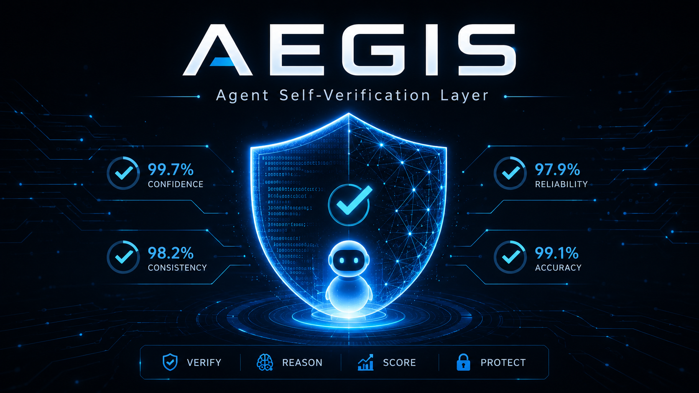

# Aegis



Lightweight evaluator wrapper for AI agents: one critique, one confidence score.


Aegis evaluates an agent's output by adding one model-backed critique step and
returning a confidence score from `0` to `100`. In V1, the evaluator can be the
wrapped agent itself or an optional connected LLM through OpenRouter.

## Quick Start

### Requirements

Aegis requires Python `3.9+`, `pip`, and a terminal. Check your Python version:

```bash
python3 --version
```

### Install From Source

Run these commands from the cloned repo root, the folder that contains `pyproject.toml`:

```bash
python3 -m venv .venv
source .venv/bin/activate
python3 -m pip install -e .
```

`-e` means editable install: Python can import `aegis`, and local code changes are picked up immediately.

After release, install from PyPI instead:

```bash
pip install aegis-ai
```

### First Run

Run the included mock example:

```bash
python3 examples/simple_usage.py
```

It prints `answer`, `confidence`, and `critique` without making network calls.

### Create Your Own Demo

Create a file:

```bash
touch demo.py
```

Open `demo.py` in your editor and add:

```python
from aegis import Aegis

class MyAgent:
    def run(self, prompt: str) -> str:
        if "Confidence:" in prompt:
            return "Confidence: 70\nCritique: This is a toy answer, so it is only partially useful."
        return "This is my agent's answer."

agent = Aegis(MyAgent())
result = agent.run("Explain vector databases in one paragraph.")

print("Answer:", result.answer)
print("Confidence:", result.confidence)
print("Critique:", result.critique)
```

Run it:

```bash
python3 demo.py
```

Aegis calls your agent twice: once for the answer, then once for the self-critique score.

### Optional Model-Backed Evaluation

Aegis does not include an API key. The repo contains example code that reads
`OPENROUTER_API_KEY`; your computer stores the real key locally.

To keep the key available after the terminal is closed, use one of these options.

Best for this repo: `.env`

Create a local `.env` file in the repo root:

```bash
cd path/to/aegis
cp .env.example .env
```

Add your key inside `.env`:

```bash
OPENROUTER_API_KEY=your_real_key_here
```

Make sure `.env` is ignored by Git:

```bash
echo ".env" >> .gitignore
```

Install dotenv:

```bash
python3 -m pip install -e ".[openrouter]"
```

The OpenRouter example loads `.env` with:

```python
from dotenv import load_dotenv

load_dotenv()
```

After that, this works even in a new terminal:

```bash
python3 examples/openrouter_model.py
```

Why it works:

- `.env` stays saved on your computer.
- `load_dotenv()` reads `.env` every time the script runs.
- `os.environ["OPENROUTER_API_KEY"]` finds the key after `.env` is loaded.
- GitHub never gets your real key.

Alternative: shell profile

Add the key to `~/.zshrc`:

```bash
echo 'export OPENROUTER_API_KEY="your_real_key_here"' >> ~/.zshrc
source ~/.zshrc
```

Then every new terminal automatically has the key. This is convenient, but
broader: any terminal project can access that key. For Aegis, `.env` is cleaner
because it is local to the repo.

Important: do not commit `.env`. Commit `.env.example` instead:

```bash
OPENROUTER_API_KEY=your_openrouter_key_here
```

## Common Issues

### `zsh: command not found: python`

Use `python3` instead:

```bash
python3 demo.py
```

### `ModuleNotFoundError: No module named 'aegis'`

Install Aegis from the repo root:

```bash
python3 -m pip install -e .
```

### I ran `touch demo.py` and nothing happened

That is normal. `touch` creates an empty file. Open it in an editor, paste the Python code, then run:

```bash
python3 demo.py
```

## Philosophy / Non-Goals

Aegis is a minimal evaluator wrapper, not a full evaluation platform.

It does:

- Run your existing agent once for an answer
- Run one model-backed critique pass
- Return `answer`, `confidence`, and `critique`

It does not:

- Retry failed answers
- Compare multiple models
- Act as an external AI judge
- Provide dashboards, benchmarks, queues, or tracing
- Replace human review for high-stakes work

## V1 Scope

V1 is limited to the smallest useful wrapper:

- Wrap an existing agent
- Run one critique step with the wrapped agent or a connected model
- Return `answer`, `confidence`, and `critique`
- Score confidence from `0` to `100`
- Support `run`, `invoke`, `generate`, and callable agents
- Include an optional OpenRouter model example for real model-backed evaluation

Everything else is deferred until after the V1 review.

## When To Use

Use Aegis when:

- You already have an agent and want a lightweight confidence signal.
- You want one extra evaluator pass without changing your agent architecture.
- You need a simple result object for routing, logging, or review thresholds.
- Your team wants a small reliability layer before investing in a full eval stack.

Do not use Aegis when:

- You need rigorous offline benchmarking or dataset-based evaluation.
- You need independent model grading instead of self-critique.
- You need automatic retries, tool repair, or autonomous correction.
- You are making high-stakes decisions that require audited verification.

## How It Works

Every `Aegis.run(prompt)` call does two things:

1. Ask your existing agent for an answer.
2. Ask the same agent, or a connected model-backed agent, to critique that answer and assign a confidence score.

The result is an `AegisResult`:

```python
result.answer      # str
result.confidence  # int, 0-100
result.critique    # str
```

See [Confidence Scoring](#confidence-scoring) for the scoring rubric.

## Confidence Scoring

Aegis asks the wrapped agent to score its answer using this exact rubric:

| Score | Label | Justification |
| --- | --- | --- |
| `90-100` | Very High | No visible issues; answer is clear, complete, and well-supported. |
| `75-89` | High | Minor issues only, such as small assumptions, mild vagueness, or missing nuance. |
| `60-74` | Moderate | Some problems, such as partial hallucination risk, logical gaps, or incomplete coverage. |
| `40-59` | Low | Significant problems, such as multiple unsupported claims, contradictions, or weak task fit. |
| `0-39` | Very Low | Major failures, such as strong hallucinations, task failure, tool misuse, or unusable output. |

Each score should include a short critique explaining why the answer landed in
that band.

## Usage Guide

### Supported Agents

Aegis can wrap any object that exposes one of these interfaces:

- `run(prompt)`
- `invoke(prompt)`
- `generate(prompt)`
- `__call__(prompt)`

The base agent only needs to accept a prompt and return a text-like response.

Aegis can extract text from:

- Plain strings
- Objects with `.content`, `.text`, `.answer`, or `.output`
- Dictionaries with `content`, `text`, `answer`, `output`, or `response`

### Basic Example

```python
from aegis import Aegis


class TheirExistingAgent:
    def run(self, prompt: str) -> str:
        if "Confidence:" in prompt:
            return (
                "Confidence: 86\n"
                "Critique: Clear and useful overall, with minor assumptions that "
                "are not fully supported by evidence."
            )

        return "Aegis adds one self-critique step and returns a confidence score."


agent = Aegis(TheirExistingAgent())
result = agent.run("What does Aegis do?")

print(result.answer)
print(result.confidence)
print(result.critique)
```

### Callable Agent

```python
from aegis import Aegis


def agent_fn(prompt: str) -> str:
    if "Confidence:" in prompt:
        return "Confidence: 91\nCritique: Direct, coherent, and well-supported."
    return "This answer came from a callable agent."


agent = Aegis(agent_fn)
result = agent.run("Say something concise.")
```

### Dict Response

```python
from aegis import Aegis


class InvokeAgent:
    def invoke(self, prompt: str) -> dict[str, str]:
        if "Confidence:" in prompt:
            return {"text": "Confidence: 78\nCritique: Good answer, but slightly vague."}
        return {"text": "This answer came from invoke()."}


agent = Aegis(InvokeAgent())
result = agent.run("Explain the wrapper.")
```

## Local Verification

Run the example:

```bash
python examples/simple_usage.py
```

Run the smoke experiment:

```bash
python experiments/sandbox_eval.py
```

Run tests:

```bash
python -m unittest discover -s tests -v
```

The tests cover `run`, `invoke`, loose critique parsing, and clear failure for
unsupported agent objects.

## API Reference

### `Aegis(agent)`

Wraps an existing agent and adds one self-verification pass.

### `Aegis.run(prompt, *args, **kwargs)`

Runs the base agent once for the answer and once for the critique. Extra
arguments are forwarded to the answer-generation call.

### `AegisResult`

```python
answer: str
confidence: int
critique: str
```

## Roadmap / Status

Aegis is currently `0.1.0` alpha. V1 is intentionally minimal and focused on
the wrapper contract.

Planned future directions:

- Optional external critic agents
- Configurable critique prompts
- Retry or repair hooks
- Dataset-based evaluation examples
- Packaging and release automation

These are intentionally out of scope for V1. The current goal is a tiny,
developer-first wrapper that is easy to understand and easy to remove.

## Included Files

- `aegis/core.py`: Core wrapper and result object
- `examples/simple_usage.py`: Minimal copy-paste example
- `examples/openrouter_model.py`: Optional model-backed OpenRouter example
- `experiments/sandbox_eval.py`: End-to-end smoke demo
- `tests/test_core.py`: Focused regression tests
