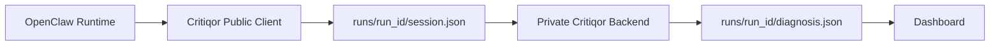

# Critiqor - Eval For OpenClaw


**EVALUATE! EVALUATE!**

Critiqor is a runtime evidence collection client for OpenClaw agents. It launches OpenClaw, observes runtime activity, writes auditable session evidence, submits that evidence to a private Critiqor diagnosis backend, and opens the dashboard with the returned diagnosis.

Critiqor does not evaluate agent outputs by asking the agent to explain itself. It records observable runtime evidence.

## Quick Start

### Step 1 - Install Critiqor

```bash
pip install critiqor
```

### Step 2 - Configure Backend Access

Set your Critiqor backend URL and, if required, an API key:

```bash
export CRITIQOR_BACKEND_URL="https://api.critiqor.ai/v1/diagnoses"
export CRITIQOR_API_KEY="your_api_key"
```

### Step 3 - Start Monitoring OpenClaw

```bash
critiqor monitor openclaw
```

Expected terminal output:

```text
✓ OpenClaw detected
✓ Runtime observer attached
✓ Event collection active

Launching OpenClaw...
```

Critiqor creates a run session, initializes evidence collection, and launches `openclaw chat` in the same terminal.

### Step 4 - Use OpenClaw Normally

OpenClaw continues operating normally. Critiqor observes runtime evidence such as:

- tool calls
- tool outputs
- retries
- memory events
- context events
- token usage
- runtime failures
- process lifecycle events

### Step 5 - Finalize Observation

When finished, exit OpenClaw and run:

```bash
critiqor finalize
```

Critiqor will:

1. stop observation
2. finalize `session.json`
3. submit evidence to the private backend
4. save the returned `diagnosis.json`
5. validate the diagnosis artifact
6. launch the dashboard

If the backend is unavailable, Critiqor does not fall back to local proprietary scoring. It leaves the evidence artifact available and prints a clear configuration error.

Historical runs can be reopened with:

```bash
critiqor runs
critiqor dashboard run_001
```

## Public Package Boundary

The public PyPI package includes only developer-facing client functionality:

- CLI commands
- session management
- OpenClaw runtime integration
- runtime evidence collection
- public event schemas
- private backend API client
- dashboard launcher
- Clawhub evidence plugin

The public PyPI package does **not** include:

- diagnosis engine
- reliability engine
- benchmark engine
- trust score algorithms
- root-cause analysis implementation
- recommendation engine
- leaderboard implementation
- internal evaluation heuristics

Those components live in the private Critiqor backend.



| Command | Purpose |
| --- | --- |
| `critiqor monitor openclaw` | Launches the OpenClaw TUI via `openclaw chat` and begins runtime observation. |
| `critiqor finalize` | Finalizes evidence, submits it to the private backend, saves `diagnosis.json`, and opens the dashboard. |
| `critiqor dashboard [run_id]` | Opens the latest or specified local diagnosis dashboard. |
| `critiqor runs` | Lists completed evaluations with summaries. |
| `critiqor help` | Shows all available Critiqor CLI commands. |

### Review Results

The dashboard displays the backend-generated diagnosis artifact:

- Executive Summary
- Primary Diagnosis
- Causal Analysis
- Cost Analysis
- Trust Assessment
- Evidence


```bash
critiqor help
critiqor monitor openclaw
critiqor finalize
critiqor dashboard
critiqor dashboard run_001
critiqor runs
```

## Evidence Artifacts

Public client artifacts are stored locally:

```text
runs/
  run_001.json
  run_001/
    session.json
    diagnosis.json
```

`session.json` is raw observed evidence. `diagnosis.json` is produced by the private backend and is the dashboard source of truth.

## Trust And Privacy

Critiqor does not:

- read agent thoughts
- scan arbitrary filesystem contents
- intercept unrelated processes
- ship proprietary scoring code in the public package

Critiqor does:

- explicitly launch/attach to the OpenClaw runtime
- collect structured runtime events
- persist auditable evidence locally
- submit evidence only to the configured backend
- render dashboard data from `diagnosis.json`

## Why Use Critiqor

Use Critiqor when you need runtime evidence for OpenClaw agent behavior, a dashboard-ready diagnosis from a controlled backend, and a clean workflow for observing agent reliability without exposing proprietary evaluation logic in the installed package.

The contribution does not include prompts, private outputs, tool outputs, or
sensitive content.

## V2 Infrastructure Guarantees

Critiqor V2 is designed as data infrastructure:

- Structured event ingestion through `IngestionAPI`.
- Tenant-aware system of record through `ReliabilityIndexStore`.
- Append-only replay support via `AgentReliabilityIndex(event_log_path=...)`.
- Streaming event abstraction through `EventStream`.
- Deterministic analytics only; no model-ranked leaderboards.
- API-driven dashboard data only; frontend visualization remains external.

## Trust Levels

The `trust_level` is derived from the evidence-weighted confidence:

| Confidence | Trust Level |
| --- | --- |
| `75-100` | `High` |
| `50-74` | `Moderate` |
| `0-49` | `Low` |


## Supported Agents

Critiqor currently supports the OpenClaw framework, but will support other agents in the future. 
It can wrap objects that expose one of these interfaces:

- `run(prompt)`
- `invoke(prompt)`
- `generate(prompt)`
- `__call__(prompt)`

The base agent only needs to accept a prompt and return a text-like response.
Critiqor can extract text from strings, common response objects, and dictionaries
with keys such as `content`, `text`, `answer`, `output`, or `response`.

## When To Use

Use Critiqor when:

- You want consistent, machine-readable reliability scores.
- You have traces, tool logs, or runtime metrics and want them reflected in the score.
- You care about tool misuse, ignored outputs, retries, loops, calibration, and task completion.
- You need to know why a run failed without manually reading traces.
- You want immediate fix recommendations for reliability failures.
- You want to compare prompt versions, model upgrades, or deployments.
- You need reproducible benchmark suites and reliability percentiles.
- You need to rank agents against peers in the same category.
- You want step-by-step causal debugging instead of flat failure labels.
- You want certification badges or CI/CD policy gates.
- You need trend and deployment-safety signals for release decisions.
- You want a lightweight path toward production observability without building a full eval platform first.

Use a generic LLM instead when:

- You only need one-off feedback.
- You want the fastest possible critique with no install step.
- You do not have execution traces and do not need evidence-weighted confidence.
- You do not need structured output, repeatable scoring criteria, or automation hooks.
- You need a full dashboard or audited enterprise collector today.

## Philosophy / Non-Goals

Critiqor V1 is a reliability layer, not an autonomous judge.

It does:

- Run your existing agent once for an answer.
- Evaluate response-only, trace-backed, or fully instrumented evidence.
- Return structured scores, evidence level, evaluation confidence, failure causes,
  a deployment recommendation, a trust label, and a short critique.
- Capture tool calls and outputs with `monitor()` or adapter events.
- Persist evaluations, compare runs, analyze historical trends, and benchmark
  against prior runs.
- Run benchmark suites, generate certification badges, check deployment policy,
  prepare anonymized benchmark contributions, and expose dashboard-ready data.
- Register agents, submit runs, generate cross-agent leaderboards, and explain
  failures as causal chains.

It does not:

- Retry or repair the answer.
- Generate improvement suggestions.
- Run benchmark datasets.
- Provide a dashboard.
- Replace human review for high-stakes work.
- Automatically observe arbitrary third-party frameworks unless they are wired
  through `CritiqorTracer`, `monitor()`, or an OpenTelemetry-compatible adapter.

## Status

Critiqor is currently `0.1.0` alpha. V1.3 supports response-only evaluation,
trace evaluation, SDK instrumentation, root-cause analysis, fix recommendations,
failure-cause detection, run comparison, historical storage, trend analysis,
deployment recommendations, benchmark suites, reliability percentiles,
certification badges, CI/CD policy checks, opt-in aggregate benchmark
contributions, dashboard data APIs, cross-agent leaderboards, causal failure
graphs, evidence confidence levels, and `High` / `Moderate` / `Low` trust
labels.

