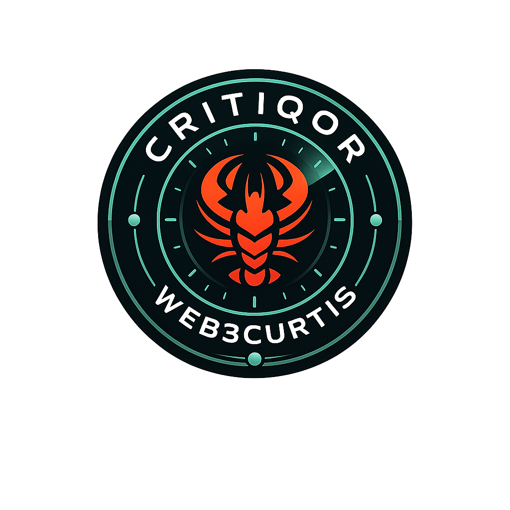
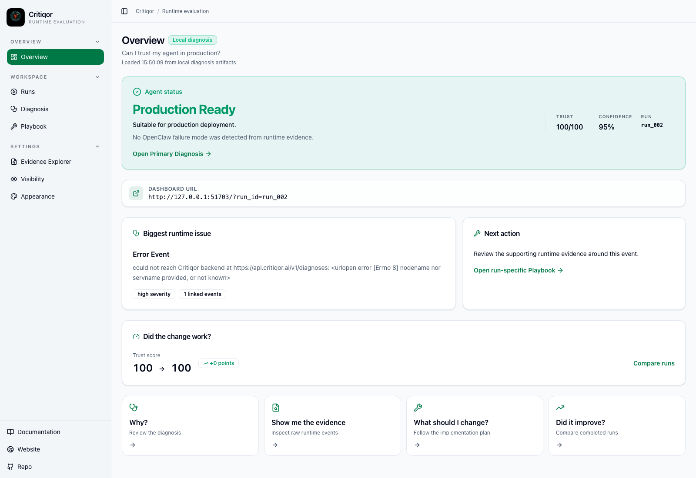
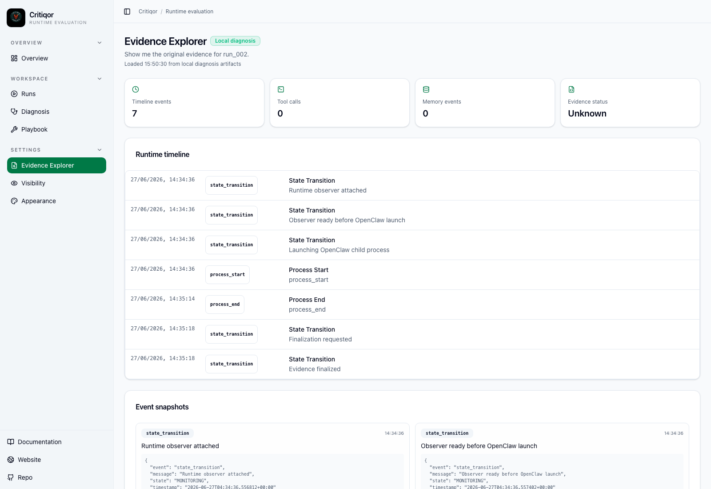

<p align="center">
  
</p>

<h1 align="center">Critiqor</h1>

<p align="center">
  <strong>Runtime Intelligence for AI Agents</strong>
</p>

<p align="center">
  Observe. Diagnose. Improve.
</p>

<p align="center">
  <a href="https://pypi.org/project/critiqor/"></a>
  
  
  
</p>

<p align="center">
  <code>pip install critiqor</code>
</p>

Critiqor helps developers understand whether an AI agent run can be trusted.
It observes the runtime, preserves evidence, generates an evidence-backed
diagnosis, and opens a local dashboard with a concrete improvement path.

Instead of judging only the final answer, Critiqor looks at what happened while
the agent worked: framework lifecycle events, tool activity, memory behavior,
errors, confidence signals, and whether the next run improved.



---

## Why Runtime Evaluation Matters

An agent can produce a useful-looking response while still behaving unreliably
during execution. It might ignore relevant memory, miss a tool failure, recover
from an error in a way that hides risk, or appear confident without enough
supporting evidence.

Critiqor gives developers a practical review layer for answering:

- Can I trust this agent run?
- Why?
- What evidence supports that diagnosis?
- What should I change?
- Did the improvement work on later runs?

---

## Supported Agent Frameworks

Critiqor 0.2.18 supports framework-based monitoring for:

- OpenClaw
- Claude Code
- Codex CLI
- Custom CLI frameworks configured with `critiqor agents` or `critiqor config`

Critiqor integrates into your existing workflow. It launches or observes the
agent command, lets you work normally, then finalizes the run into a local
diagnosis dashboard.

---

## Installation

Install Critiqor from PyPI:

```bash
pip install critiqor
```

Check the CLI:

```bash
critiqor help
```

Use Python 3.10 or newer. `pipx install critiqor` is a good option if you prefer
an isolated CLI install.

---

## Quick Start

### 1. Choose an agent framework

```bash
critiqor agents
```

The guided setup lets you choose OpenClaw, Claude Code, Codex, or a custom CLI
framework and observation method.

### 2. Start an observation

Use the monitor command for your framework:

```bash
critiqor monitor openclaw
critiqor monitor cc
critiqor monitor codex
```

Custom frameworks can be launched through the command you configure in the
guided setup.

### 3. Work normally

Use the agent as you usually would. Critiqor stays beside the workflow and
collects runtime evidence for review.

### 4. Finalize the run

```bash
critiqor finalize
```

Critiqor stops the observation, generates a diagnosis, and opens the local
dashboard.

### 5. Reopen reports

```bash
critiqor runs
critiqor dashboard
critiqor dashboard run_001
```

---

## CLI Workflow

```text
critiqor agents
        ↓
Select Framework
        ↓
Choose Observation Method
        ↓
Launch Agent
        ↓
Work Normally
        ↓
critiqor finalize
        ↓
Dashboard Opens
```

Core commands:

- `critiqor agents` - choose and configure an AI agent framework
- `critiqor config` - update observation method or custom framework details
- `critiqor monitor openclaw` - launch OpenClaw and begin runtime observation
- `critiqor monitor cc` - launch Claude Code and begin runtime observation
- `critiqor monitor codex` - launch Codex CLI and begin runtime observation
- `critiqor finalize` - stop observation, generate diagnosis, and open dashboard
- `critiqor dashboard [run_id]` - open the latest or selected diagnosis dashboard
- `critiqor runs` - list completed evaluations with summaries
- `critiqor doctor` - check local readiness before running evaluations

---

## Dashboard

After finalization, Critiqor opens a local dashboard focused on the developer
questions that matter after an agent run.

Key sections:

- **Overview** - production verdict, trust score, confidence, current run, and the
  fastest path to diagnosis, evidence, playbook, and comparison.
- **Runs** - completed evaluations you can reopen and compare.
- **Diagnosis** - the primary issue, root cause, evidence, runtime impact, and
  engineering explanation.
- **Playbook** - recommended changes, verification steps, expected improvement,
  trade-offs, and alternatives.
- **Evidence Explorer** - timeline events, tool calls, memory events, evidence
  status, and raw event snapshots.
- **Visibility** - private, shared, anonymous, and public review modes.
- **Appearance** - readable dashboard display settings.
- **Export Diagnosis** - PDF, Markdown, HTML, PNG, diagnosis JSON, session JSON,
  and ZIP export options.
- **Copy Fix Prompt** - a run-specific prompt you can paste into an AI coding
  assistant to improve the agent using the observed evidence.

The dashboard supports light and dark appearance modes, so exported screenshots
and team reviews can match the environment where developers are working.



---

## What's New in 0.2.18

Critiqor 0.2.18 adds WebMCP runtime evaluation when a run includes WebMCP
events, plus a tighter dashboard review path.

- WebMCP runs produce an evidence-backed diagnosis, a run-specific improvement
  playbook, and a detailed Copy Fix Prompt from the selected run artifacts.
- Diagnosis, Playbook, and Evidence share a Focus run dropdown bound to
  `run_id`, so another run is never substituted.
- Engineer Brief, Executive Summary, and Agent Health cards open the same
  keyboard-accessible detail view. Missing fields stay unavailable.
- The local dashboard is served from the bundled production build.

## What's New in 0.2.16

Critiqor 0.2.16 focuses on runtime memory evaluation and the matching dashboard
experience.

- Memory behavior is included in the diagnosis workflow when evidence is
  available.
- Retrieved, injected, referenced, unused, irrelevant, missed, created, ignored,
  and not-stored memory events can be explained from runtime evidence.
- Copy Fix Prompt includes memory behavior, supporting evidence, suggested
  architectural improvements, testing strategy, and success criteria.
- The dashboard reflects the current diagnosis, evidence, playbook, export, and
  visibility workflow.
- OpenClaw, Claude Code, Codex CLI, and custom framework workflows are presented
  as first-class ways to observe AI agents.

---

## Export and Team Review

Critiqor reports can be used to:

- improve prompts, tools, memory, and agent architecture
- share a diagnosis with teammates
- document runtime evaluations
- compare whether changes improved later runs
- provide evidence for release or review decisions

Export options include PDF, Markdown, HTML, PNG, diagnosis JSON, session JSON,
and ZIP bundles.

---

## Visibility Modes

Critiqor supports dashboard visibility settings from the developer's point of
view:

- **Private** - local owner review.
- **Shared** - invite-based review for teammates.
- **Anonymous** - redacted review without exposing identifying details.
- **Public** - open dashboard access when you intentionally choose it.

Configure visibility through `critiqor config`, then relaunch the dashboard.

---

## Operating System Compatibility

| Operating system | Compatibility | Recommended install path |
| --- | --- | --- |
| macOS | Supported | Python 3.10+ with `pip` or `pipx` |
| Linux | Supported | Distro Python package manager, then `pip` or `pipx` |
| Windows | Supported with WSL recommended | WSL2 for terminal agent workflows, or native Windows Python for basic CLI usage |

For the most reliable terminal-agent monitoring on Windows, use WSL2.

---

## Links

- Website: https://critiqor-runtime-insight.vercel.app/
- Documentation: https://critiqor-71f5274a.mintlify.site/
- PyPI: https://pypi.org/project/critiqor/
- Source: https://github.com/web3curtis/Critiqor

---

## License

MIT
