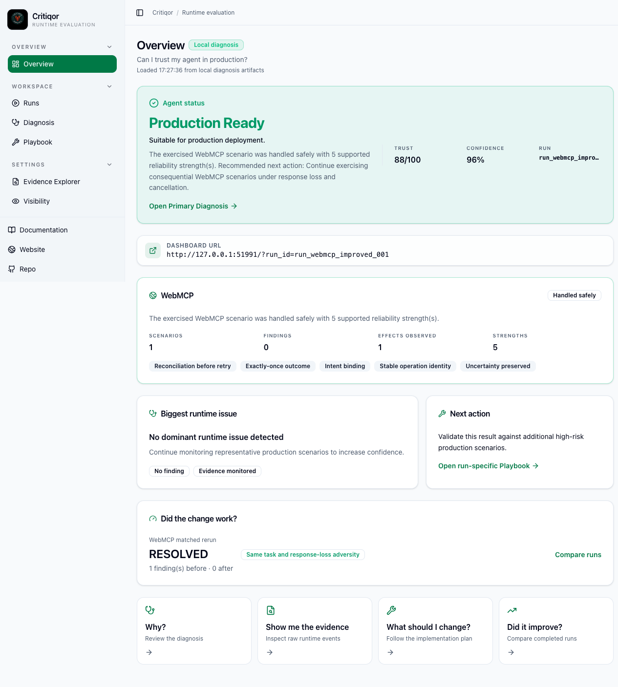
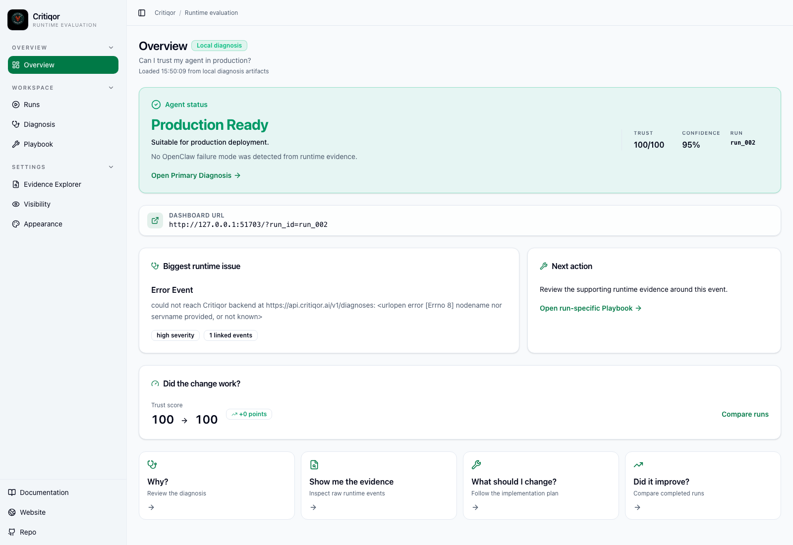
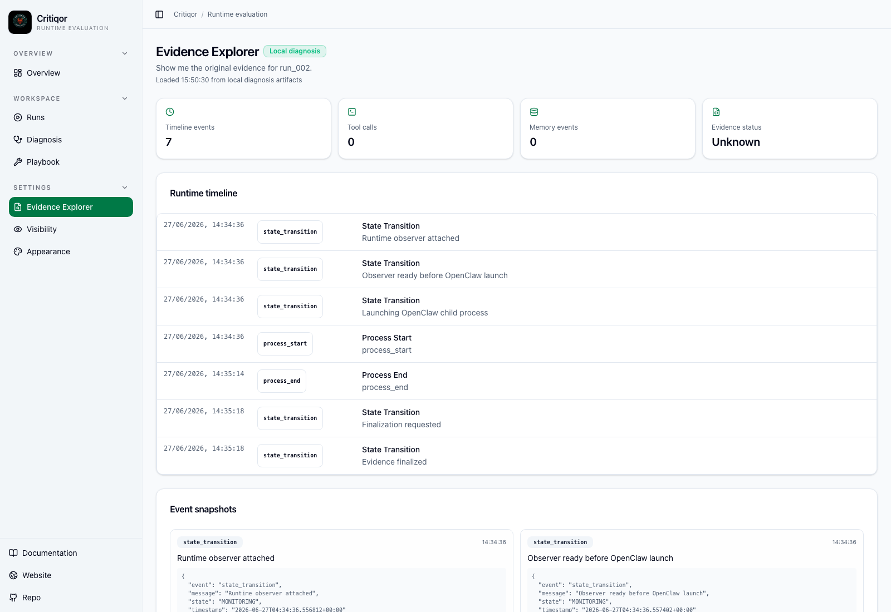

<p align="center">
  
</p>

<h1 align="center">Critiqor</h1>

<p align="center">
  <strong>Runtime Intelligence for AI Agents</strong>
</p>

<p align="center">
  Observe. Diagnose. Improve.
</p>

<p align="center">
  <a href="https://pypi.org/project/critiqor/"></a>
  
  
  
</p>

<p align="center">
  <code>pip install critiqor</code>
</p>

Critiqor helps developers answer one question after an AI agent finishes:
**can I trust what just happened?**

It observes the runtime—not only the final answer—then turns tool activity,
framework events, memory behavior, errors, and confidence signals into an
evidence-backed diagnosis and a concrete improvement path.



## From agent run to actionable diagnosis

```text
Choose a framework → Observe the run → Finalize → Diagnose → Improve → Compare
```

```bash
# Choose OpenClaw, Claude Code, Codex CLI, or a custom framework
critiqor agents

# Work with the agent through the configured monitor, then finalize
critiqor finalize
```

Finalization opens the Critiqor dashboard for the selected run. From there you
can inspect the primary diagnosis, trace it back to runtime evidence, follow a
run-specific playbook, and compare a later run to see whether the change worked.

## Highlights

<table>
  <tr>
    <td width="50%" valign="top">
      <strong>Production verdict at a glance</strong><br><br>
      
      <br><br>See trust, confidence, the biggest runtime issue, and the next action without searching through logs.
    </td>
    <td width="50%" valign="top">
      <strong>Evidence you can inspect</strong><br><br>
      
      <br><br>Trace a conclusion back to timeline events, tool calls, memory behavior, and original event snapshots.
    </td>
  </tr>
  <tr>
    <td width="50%" valign="top">
      <strong>Primary diagnosis and playbook</strong><br><br>
      <em>Screenshot placeholder — anonymous Diagnosis and Improvement Playbook views.</em>
      <br><br>Understand the root cause, why it matters, what to change, and how to verify the fix.
    </td>
    <td width="50%" valign="top">
      <strong>Matched before-and-after evaluation</strong><br><br>
      
      <br><br>Compare the same task under the same adversity and see whether the failure was actually resolved.
    </td>
  </tr>
</table>

## Privacy comes first

Critiqor supports four deliberate visibility modes:

| Mode | Intended use |
| --- | --- |
| **Private** | Local owner review |
| **Shared** | Invite-based team review |
| **Anonymous** | Redacted review without identifying details |
| **Public** | Open access only when intentionally enabled |

Use **Anonymous** for screenshots, demonstrations, and external reviews.
Anonymous dashboard responses replace user home and temporary paths, remove
agent and tenant identifiers, and hide raw artifact fields. Screenshots and
exports must still be reviewed for task-specific URLs or other sensitive
context before publication.

```bash
critiqor config
```

Choose **Anonymous** under visibility, then reopen or regenerate the dashboard.

## CLI workflow

The guided setup connects Critiqor to the way you already use an agent:

- **OpenClaw** — `critiqor monitor openclaw`
- **Claude Code** — `critiqor monitor cc`
- **Codex CLI** — `critiqor monitor codex`
- **WebMCP** — `critiqor monitor webmcp`
- **Custom CLI framework** — configure its command with `critiqor agents`

<p align="center">
  <em>GIF placeholder — framework selection → observation method → Anonymous visibility.<br>
  Planned file: <code>assets/gifs/critiqor-cli-setup.gif</code></em>
</p>

After working normally, finalize and revisit reports with:

```bash
critiqor finalize
critiqor runs
critiqor dashboard
critiqor dashboard run_001
```

<p align="center">
  <em>GIF placeholder — monitoring → agent task → finalize → dashboard opens.<br>
  Planned file: <code>assets/gifs/critiqor-run-to-dashboard.gif</code></em>
</p>

Other useful commands:

- `critiqor help` — list the available CLI workflows
- `critiqor config` — update observation and visibility settings
- `critiqor doctor` — check local readiness
- `critiqor runs` — list completed evaluations

## What the dashboard answers

- **Overview:** Is this run production-ready, and what needs attention first?
- **Diagnosis:** What is the primary issue, and what evidence supports it?
- **Playbook:** What should change, and how should the improvement be verified?
- **Evidence Explorer:** What actually happened during execution?
- **Runs:** Did a later matched run improve?
- **Copy Fix Prompt:** How can I hand the evidence and success criteria to a coding agent?
- **Export:** How can I share a PDF, Markdown, HTML, PNG, JSON, or ZIP report?

## WebMCP research prototype

Critiqor WebMCP began as an initial research prototype for the
[OpenAI WebMCP Challenge](https://openai.com/webmcp-challenge/). It applies
Critiqor's observe → diagnose → improve loop to a consequential browser action
whose response can be lost even when the underlying effect succeeds.

- [View the Critiqor WebMCP submission on Devpost](https://devpost.com/software/critiqor-webmcp?ref_content=user-portfolio&ref_feature=in_progress)
- [Open the live Critiqor × Crema reliability artifact](https://critiqor-crema-reliability.terrence-qiu-7311.chatgpt.site/)

The controlled Crema experiment compares two matched runs:

1. A baseline agent loses the response to a committed cart mutation and retries
   blindly, creating a duplicate effect.
2. The improved agent preserves uncertainty, reconciles against authoritative
   state, and stops after confirming the original effect.

Critiqor records the consequential invocation, ambiguous outcome,
reconciliation attempt, and authoritative state so the conclusion remains
auditable rather than inferred from an error message.

<p align="center">
  <em>GIF placeholder — matched baseline and improved Crema experiment.<br>
  Planned file: <code>assets/gifs/critiqor-crema-experiment.gif</code></em>
</p>

The browser monitor, evidence contract, and reproduction instructions are in
[`explorations/webmcp-reliability`](explorations/webmcp-reliability) and
[`docs/webmcp-browser-monitor.md`](docs/webmcp-browser-monitor.md).

## Live WebMCP monitoring

Critiqor can observe browser-native WebMCP discovery, invocation, outcome,
reconciliation, and authoritative-state events through an explicitly approved
Chrome remote-debugging endpoint.

```bash
critiqor monitor webmcp \
  --cdp-url http://127.0.0.1:9222 \
  --target-url http://127.0.0.1:3000 \
  --task-id add-one-item \
  --scenario-id lost-response \
  --consequential-tool add_to_cart \
  --reconciliation-tool get_cart \
  --authoritative-tool get_cart
```

Critiqor does not treat an opaque error, cancellation, or lost response as a
safe failure. The result remains `unknown` until target-owned state reconciles
it. Optional fault injection is narrow, one-shot, and bound to the exact target,
HTTP method, and consequential tool.

## Installation and compatibility

Critiqor requires Python 3.10 or newer. For an isolated CLI installation:

```bash
pipx install critiqor
critiqor help
critiqor doctor
```

| Operating system | Support |
| --- | --- |
| macOS | Supported |
| Linux | Supported |
| Windows | WSL2 recommended for terminal-agent monitoring; native Python supports basic CLI use |

The PyPI release history is intentionally retained for reproducible installs
and compatibility with earlier APIs. New users receive the current release
with `pip install critiqor`; they do not need to install earlier versions.

## Architecture and licensing

This repository contains Critiqor's public CLI, runtime collectors, evidence
schemas, integrations, and dashboard. Proprietary diagnosis, scoring,
benchmarking, and reliability-engine implementation is not distributed in this
repository.

The public repository is licensed under the [Apache License 2.0](LICENSE).
Apache 2.0 permits use, inspection, modification, and redistribution subject to
its conditions; it does not conceal public source code. Critiqor's private
engine stays private by remaining outside the distributed package and public
repository.

## Release history

Published versions remain available on [PyPI](https://pypi.org/project/critiqor/#history)
so existing pinned installations continue to work. Git tags should identify
the exact source commit for each published release; related patch releases are
summarized together in [`CHANGELOG.md`](CHANGELOG.md) rather than collapsed into
one ambiguous tag.

See [`docs/releasing.md`](docs/releasing.md) for the release checklist and
compatibility notes.

## License

Apache-2.0
